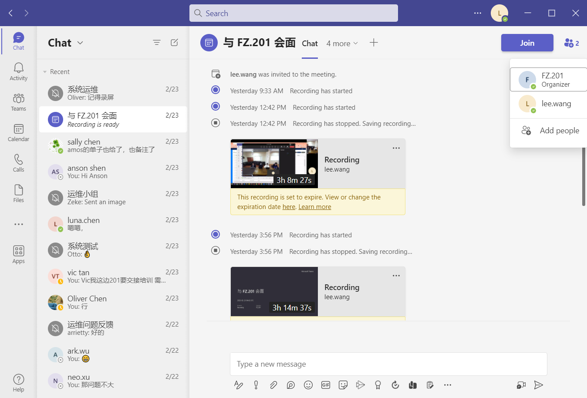

# 智能教室+白板交互 PRD

[toc]

## 1

智能教室+白板交互PRD

概述：
本文档旨在描述智能教室+白板交互项目的产品需求，该产品旨在提高教师和学生的课堂互动和参与度，提高教学效果和教育质量。

功能需求：

白板基础功能：支持教师在白板上书写、绘画，支持学生在白板上手写笔记、涂鸦；
教学工具库：提供教学工具库，支持教师添加教学元素、图形等；
班级互动：支持教师进行班级互动，学生可以在线回答问题、提问等；
课件管理：支持教师进行课件的录制、管理、编辑、分享等；
屏幕共享：支持教师和学生进行屏幕共享，便于教师演示软件操作等；
语音识别：支持白板上语音的识别和转换，便于教师进行语音输入，提高教学效率；
多端同步：支持多端同步，学生可以在电脑、平板、手机等多种设备上使用。
性能需求：

白板反应速度：白板的反应速度要求快，能够保证教师的书写和绘画的连贯性；
显示效果：白板需要支持高清、高亮度的显示，以保证教师和学生的视觉体验；
多点触控：白板需要支持多点触控，能够支持多个学生同时进行手写输入和操作；
网络稳定性：系统需要稳定、快速的网络环境，以确保在线学习的顺畅进行；
数据安全性：系统需要保障用户数据的安全性和隐私保护。
用户需求：

教师需求：提供易于使用的教学工具，支持班级互动和课件管理；
学生需求：提供良好的使用体验，支持多端同步，提高学习效率；
管理员需求：提供简便的管理方式，支持教师、学生的账号管理和数据管理。
其他需求：

系统应该易于部署和维护；
系统应该提供完善的技术支持和客户服务；
系统应该支持不同语言和地区的使用。
结语：
本文档描述了智能教室+白板交互项目的产品需求，从功能

## 2 

产品概述：
智能教室+白板交互方案是一种专门为中小学和高等教育机构设计的教育解决方案，旨在为教育行业提供一种全新的教学方式，实现教学智能化、数字化、互动化。

目标用户：
该产品面向中小学、高等教育机构等各类教育场景，主要服务于教师和学生。

核心功能：

白板交互：提供智能电子白板，支持多点触控、手写输入，让教师可以更加自由地书写、绘画，让学生可以更加积极地参与到课堂中来。
课件制作：提供多种教学软件，例如OneNote、SMART Notebook、StarBoard等，让教师可以在电子白板上制作课件、添加多媒体内容、录制课程视频等，让学生可以随时随地进行在线学习。
互动式教学：通过电子白板和在线学习平台，提供多种互动式教学方式，例如投票、问答、在线讨论等，激发学生的学习兴趣，提高课堂参与度。
学习管理：提供学习管理平台，支持学生课堂签到、学习记录、成绩查询等功能，方便教师和学生进行学习管理和数据分析。
产品优势：

教学方式更加便捷、高效：智能教室+白板交互方案可以提供多种教学方式，让教师可以更加自由地控制课堂内容，学生也可以更加积极地参与到课堂中来，提高教学效率。
提升学生学习体验：通过互动式教学、在线学习等方式，激发学生的学习兴趣和学习热情，提高学习体验和学习效果。
优化学习管理：提供学习管理平台，方便教师和学生进行学习管理和数据分析，为教育行业的数字化转型提供支持。
开发计划：

第一阶段：产品需求分析和用户调研（1个月）
第二阶段：系统设计和开发（4个月）
第三阶段：测试和部署（1个月）
第四阶段：上线和推广（2个月）
风险和挑战：

技

## 智能教室+白板交互解决方案文档

概述：
智能教室+白板交互解决方案旨在为教育机构提供一种更加便捷、高效的教学方式。该解决方案将智能教室和白板技术结合起来，让教师可以更加自由地控制课堂内容，学生也可以更加积极地参与课堂。该方案的实现需要软件、硬件、网络等多方面的支持，下面将逐一介绍。

硬件设备：
智能教室需要配备多媒体投影仪、电子白板、电脑、音响等设备。投影仪需要支持高清、高亮度的显示，白板需要支持多点触控、手写输入等功能，电脑需要配备高性能的CPU和显卡以保证教学软件的运行流畅。

软件支持：
智能教室+白板交互的实现离不开软件的支持。目前市场上有很多教学软件可以选择，例如微软的OneNote、SMART Notebook、StarBoard等。这些软件可以让教师在电子白板上书写、绘画、录制课件等，让学生通过电子设备进行互动学习。同时，也需要支持课件的存储、管理和分享等功能，以方便教师和学生使用。

网络建设：
智能教室需要配备高速、稳定的网络环境，以确保在线学习的流畅进行。网络设备需要具备良好的信号覆盖、带宽支持和安全保障等特点，可以选择校园网、无线局域网等网络建设模式。

应用场景：
智能教室+白板交互方案可以应用于中小学、高等教育机构等各类教育场景。在课堂教学中，教师可以利用白板实现多种教学方式，例如在白板上进行互动式教学、展示课件、展示视频等。同时，学生也可以通过白板上的手写笔记、在线互动等方式更好地参与到课堂中来。

结语：
智能教室+白板交互方案可以带来更加便捷、高效的教学方式，提高学生学习效率，增强教学质量。当然，在实际应用过程中，还需要根据具体情况进行合理的配置和使用。

## 营销方案

针对 https://www.qnextech.com/ 网站的营销方案描述如下：

1. SEO 优化： 通过关键字研究，对网站进行SEO优化，提升网站在搜索引擎上的排名，增加网站的流量和曝光度。
2. 内容营销：发布高质量、有价值的内容，吸引潜在客户，增加网站的访问量和留存率，提高转化率。
3. 社交媒体推广：利用社交媒体平台（如Facebook，LinkedIn等），进行品牌宣传和推广，提高品牌知名度和用户参与度。
4. 电子邮件营销：通过向潜在客户发送电子邮件，提高品牌认知度，促进转化率，增加销售量。
5. 合作伙伴营销：与相关的行业领导者、网站、博客等建立联系，推广品牌，增加品牌曝光度。
6. 搜索引擎广告：通过搜索引擎广告投放，增加网站曝光度，提高转化率，吸引更多的潜在客户。
7. 事件营销：参加相关的活动和展会，展示公司产品和服务，增加品牌曝光度和用户参与度。
8. 视频营销：制作宣传视频，放在社交媒体和网站上进行推广，吸引潜在客户，提高品牌知名度和转化率。

以上是一些可能适用于 https://www.qnextech.com/ 网站的营销方案，具体的营销策略应根据公司的目标、受众和预算等因素来制定。

给我一些关于  https://www.qnextech.com/ 产品社交媒体推广的文案

- "了解 QNEXTECH 最新的创新产品，让您的生活更加便捷，体验未来科技的魅力。"
- "热烈推荐 QNEXTECH 的产品，创新科技引领未来，我们致力于让每一个用户都感受到未来的潮流。"
- "现在就加入 QNEXTECH 的创新科技社区，与全球用户分享您的使用心得和体验，让我们一起体验未来的科技魅力。"
- "QNEXTECH 产品的卓越性能和设计，让您享受前所未有的使用体验，快来加入我们的社交媒体平台，了解更多创新科技动态。"
- "在 QNEXTECH，我们一直致力于开发出最具创新性和前瞻性的科技产品，让您的生活更加美好和便捷。现在就加入我们的社交媒体平台，与我们一起探索未来科技的潜力。"
- "QNEXTECH 产品的品质和性能经得起用户的考验，现在就加入我们的社交媒体平台，与全球用户分享您的使用心得和体验。"
- "QNEXTECH 是一个充满活力和创造力的科技公司，我们为用户提供高质量的产品和服务。现在就加入我们的社交媒体平台，了解更多创新科技动态。"
- "QNEXTECH 产品以其卓越的品质和性能，赢得了广大用户的信任和好评。现在就加入我们的社交媒体平台，一起探索未来科技的发展方向。"

- “Discover the latest innovative products from QNEXTECH that make your life more convenient and let you experience the charm of future technology."
- "We highly recommend QNEXTECH's products that lead the future with innovative technology. We are committed to making every user feel the trend of the future."
- "Join QNEXTECH's innovative technology community now, share your experience and usage with global users, and let's experience the charm of future technology together."
- "QNEXTECH's outstanding performance and design allow you to enjoy an unprecedented user experience. Join our social media platform now to learn more about innovative technology trends."
- "At QNEXTECH, we have always been committed to developing the most innovative and forward-looking technology products, making your life better and more convenient. Join our social media platform now to explore the potential of future technology together."
- "QNEXTECH's products have been tested by users and proven for their quality and performance. Join our social media platform now to share your experience and usage with global users."
- "QNEXTECH is a vibrant and creative technology company that provides high-quality products and services to users. Join our social media platform now to learn more about innovative technology trends."
- "QNEXTECH's products have won the trust and praise of a wide range of users with their outstanding quality and performance. Join our social media platform now to explore the direction of future technology together."

### 宣传文案

以下是关于 Q-NEX Console 的宣传文案：

标题：Q-NEX Console — 让您的工作流程更加高效和安全

正文：Q-NEX Console 是一款集成了高级安全功能的终端管理软件，旨在帮助企业实现高效的 IT 管理和更安全的工作流程。作为一款全面的终端管理解决方案，Q-NEX Console 可以让您：

实现一键式批量部署和管理多个终端设备，从而降低管理成本；
自动化软件更新和安装，避免人为失误和疏漏；
实现灵活的权限管理，确保敏感信息的安全性；
提供实时监控和日志记录，帮助您及时发现和解决潜在问题；
支持跨平台使用，适用于 Windows、Linux 和 macOS 等主流操作系统。
Q-NEX Console 还提供了多种高级安全功能，如数据加密、防病毒保护、恶意软件检测等，从而帮助企业更好地保护其数据和信息安全。无论您是 IT 管理员、安全专家还是普通用户，Q-NEX Console 都能帮助您实现更高效、更安全的工作流程。

立即下载 Q-NEX Console，让您的工作更加高效和安全。

Title: Q-NEX Console - Make your workflow more efficient and secure

Body: Q-NEX Console is an integrated endpoint management software with advanced security features designed to help enterprises achieve efficient IT management and secure workflow. As a comprehensive endpoint management solution, Q-NEX Console allows you to:

Achieve one-click bulk deployment and management of multiple endpoint devices, reducing management costs;
Automate software updates and installations, avoiding human errors and omissions;
Implement flexible permission management to ensure the security of sensitive information;
Provide real-time monitoring and log recording to help you identify and resolve potential issues promptly;
Support cross-platform usage, suitable for mainstream operating systems such as Windows, Linux, and macOS.
Q-NEX Console also provides various advanced security features such as data encryption, anti-virus protection, and malware detection to help enterprises better protect their data and information security. Whether you are an IT administrator, security expert, or ordinary user, Q-NEX Console can help you achieve a more efficient and secure workflow.

Download Q-NEX Console now to make your work more efficient and secure.

### 营销故事

故事开始在一家中小型企业，这家企业规模虽然不算大，但业务却异常繁忙。员工们需要使用各种不同的终端设备来完成日常工作，包括笔记本电脑、台式机、智能手机等。这些终端设备的数量不断增加，管理和维护成本也越来越高，而且企业数据的安全也日益受到威胁。

为了解决这些问题，企业决定寻找一款全面的终端管理解决方案。在多方比较和评估之后，他们选择了 Q-NEX Console。Q-NEX Console 提供了多种高级安全功能，如数据加密、防病毒保护、恶意软件检测等，从而帮助企业更好地保护其数据和信息安全。与此同时，Q-NEX Console 还可以实现一键式批量部署和管理多个终端设备，自动化软件更新和安装，并提供灵活的权限管理，从而大大降低了管理成本，提高了工作效率。

企业员工们很快就感受到了 Q-NEX Console 的好处。以前需要耗费大量时间和精力来管理和维护终端设备，现在只需要轻松地使用 Q-NEX Console 进行管理和维护。他们还发现 Q-NEX Console 提供了实时监控和日志记录功能，可以帮助他们及时发现和解决潜在问题，让工作更加高效和安全。

随着时间的推移，企业扩大了规模并增加了更多的终端设备，但是由于有了 Q-NEX Console 的帮助，他们的管理成本并没有增加，反而更加精简高效。Q-NEX Console 已经成为了这家企业的重要工具，不仅提高了企业的工作效率，也为企业的发展奠定了坚实的基础。

The story begins in a small to mid-sized enterprise that was experiencing a high volume of business activity. Employees needed to use various devices to complete their daily work, including laptops, desktops, and smartphones. As the number of devices continued to grow, so did the cost of managing and maintaining them, and the security of the company's data became increasingly threatened.

To solve these issues, the enterprise decided to search for a comprehensive endpoint management solution. After comparing and evaluating multiple options, they chose Q-NEX Console. Q-NEX Console offers various advanced security features, such as data encryption, anti-virus protection, and malware detection, to help enterprises better protect their data and information security. At the same time, Q-NEX Console can achieve one-click bulk deployment and management of multiple endpoint devices, automate software updates and installations, and provide flexible permission management, greatly reducing management costs and improving work efficiency.

Employees quickly realized the benefits of Q-NEX Console. Previously, it took a lot of time and effort to manage and maintain endpoint devices, but now they could easily manage and maintain them using Q-NEX Console. They also found that Q-NEX Console provided real-time monitoring and log recording, which helped them identify and resolve potential issues promptly, making their work more efficient and secure.

As time went by, the enterprise grew and added more endpoint devices, but with the help of Q-NEX Console, their management costs did not increase. Instead, they became more streamlined and efficient. Q-NEX Console has become an essential tool for the enterprise, not only improving work efficiency but also laying a solid foundation for the company's development.

