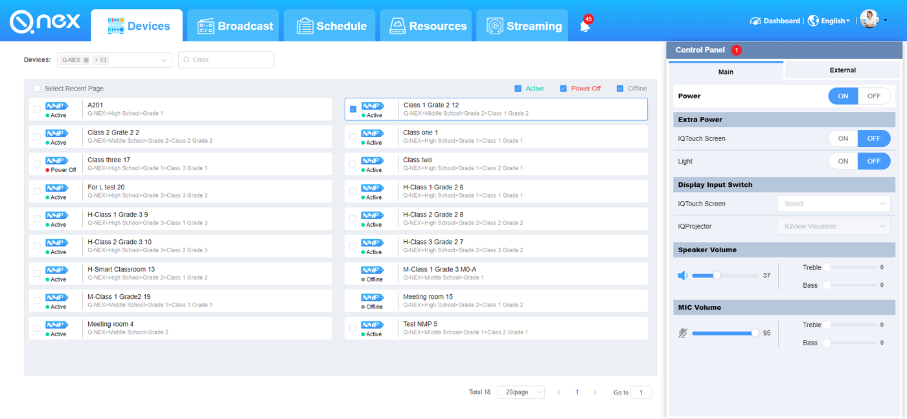

### 营销故事

X公司一家高速发展中的企业，随着公司规模扩大，业务开始异常繁忙。员工们需要使用各种不同的终端设备来完成日常工作，包括笔记本电脑、台式机、智能手机等。这些终端设备的数量不断增加，管理和维护成本也越来越高，而且企业数据的安全也日益受到威胁。

为了解决这些问题，企业决定寻找一款全面的终端管理解决方案。在多方比较和评估之后，他们选择了 Q-NEX Console。Q-NEX Console 提供了多种高级安全功能，如数据加密、防病毒保护、恶意软件检测等，从而帮助企业更好地保护其数据和信息安全。与此同时，Q-NEX Console 还可以实现一键式批量部署和管理多个终端设备，自动化软件更新和安装，并提供灵活的权限管理，从而大大降低了管理成本，提高了工作效率。

企业员工们很快就感受到了 Q-NEX Console 的好处。以前需要耗费大量时间和精力来管理和维护终端设备，现在只需要轻松地使用 Q-NEX Console 进行管理和维护。他们还发现 Q-NEX Console 提供了实时监控和日志记录功能，可以帮助他们及时发现和解决潜在问题，让工作更加高效和安全。

随着时间的推移，企业扩大了规模并增加了更多的终端设备，但是由于有了 Q-NEX Console 的帮助，他们的管理成本并没有增加，反而更加精简高效。Q-NEX Console 已经成为了这家企业的重要工具，不仅提高了企业的工作效率，也为企业的发展奠定了坚实的基础。

X Company is a rapidly growing enterprise, and as the company's scale expands, its business has become more and more busy. Employees needed to use various devices to complete their daily work, including laptops, desktops, and smartphones. As the number of devices continued to grow, so did the cost of managing and maintaining them, and the security of the company's data became increasingly threatened.

To solve these issues, the enterprise decided to search for a comprehensive endpoint management solution. After comparing and evaluating multiple options, they chose Q-NEX Console. Q-NEX Console offers various advanced security features, such as data encryption, anti-virus protection, and malware detection, to help enterprises better protect their data and information security. At the same time, Q-NEX Console can achieve one-click bulk deployment and management of multiple endpoint devices, automate software updates and installations, and provide flexible permission management, greatly reducing management costs and improving work efficiency.

Employees soon realized the benefits of Q-NEX Console. Previously, it took a lot of time and effort to manage and maintain endpoint devices, but now they could easily manage and maintain them using Q-NEX Console. They also found that Q-NEX Console provided real-time monitoring and log recording, which helped them identify and resolve potential issues promptly, making their work more efficient and secure.

As time went by, the enterprise grew and added more endpoint devices, but with the help of Q-NEX Console, their management costs did not increase. Instead, they became more streamlined and efficient. Q-NEX Console has become an essential tool for the enterprise, not only improving work efficiency but also laying a solid foundation for the company's development.

## 2

IQBoard是一家提供教育技术解决方案的公司，其网站https://www.iqboard.net/主要展示的是他们的产品和服务。以下是该网站的产品功能：

- 电子白板：这是IQBoard的核心产品，它是一种可用于交互式课堂的数字化白板，支持手写、演示、标注和多媒体教学功能。
- 视频会议系统：IQBoard提供了一系列视频会议系统，能够满足不同场景下的视频会议需求。
- 数字化教育解决方案：IQBoard为学校和机构提供定制化的数字化教育解决方案，包括智慧校园、在线课堂、课程资源库等。
- 教育软件：IQBoard提供一系列教育软件，能够满足不同科目和年级的教学需求。